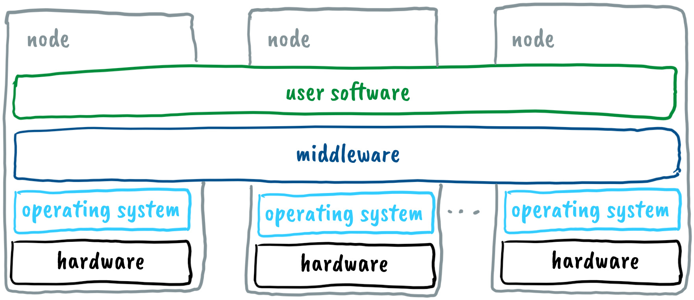
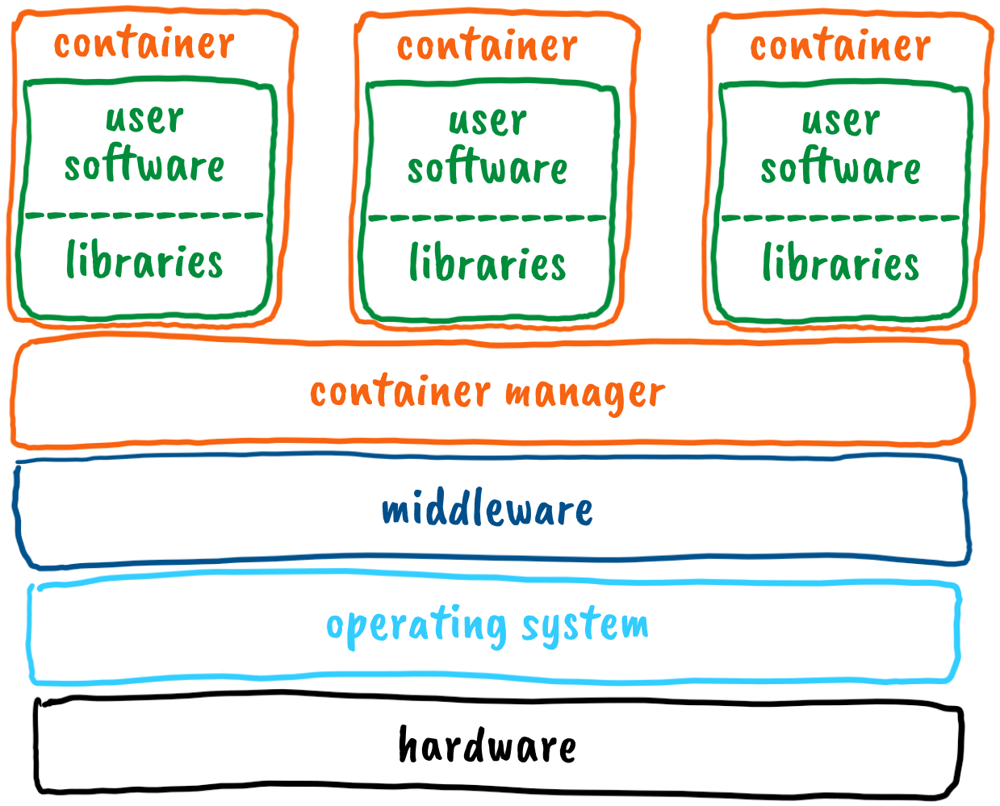
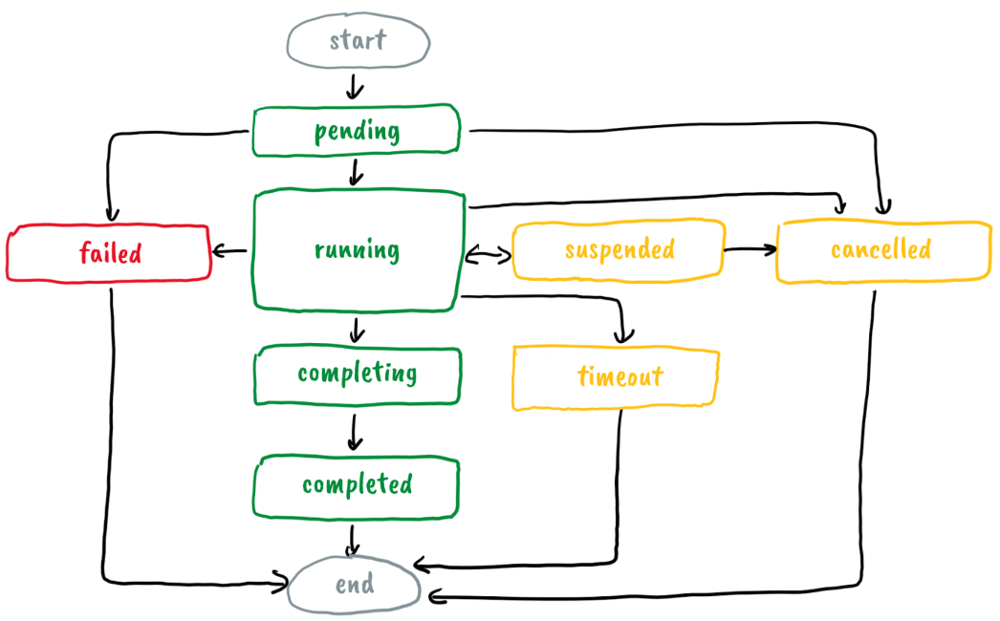

# Cluster

## Hardware

- in previous chapter we only focused on the compute nodes
- the architecture of typical cluster is as follows

  

  - the head nodes keeps the whole cluster running in a coordinated manner - it runs programs that monitor the status of other nodes, distribute jobs to compute nodes, supervise job execution, and perform other management tasks

  - the login nodes enable users to work with the cluster - transfer data and programs to and from the cluster, prepare, monitor, and manage jobs for compute nodes, reserve computational resources on compute nodes, log in to compute nodes, and similar

  - compute nodes execute the jobs prepared on the login nodes; there are various types of compute nodes available, including CPU-only nodes, high-performance CPU nodes with more memory, nodes equipped with graphics accelerators, and special notes with FPGA accelerators; based on their characteristics, compute nodes are organized in partitions

  - data and programs are stored on data nodes, which form a distributed file system, such as ceph: the distributed file system is accessible to all login and compute nodes - files transferred to the cluster through the login node are stored in the distributed file system

  - all nodes are interconnected by high-speed network links, typically Ethernet and sometimes InfiniBand (IB); network links are preferably high bandwidth and low latency

## Software

- the main software components:

  

  - operating system
    - performs basic tasks such as memory management, processor management, device control, file system management, security functions, system operation control, resource usage monitoring, and error detection
    - preferably open source (AlmaLinux)

  - middleware
    - connects the operating system and user applications within the cluster
    - it ensures the coordinated operation of multiple nodes, enables centralized node management, handles user authentication, 
    controls job execution (user applications) on the compute nodes
    - preferably open-source software:
      - automation through Foreman, Puppet, Ansible
      - administration and metrics: ElasticSearch, Syslog, Icinga, Nagios, IPMI, 
      - monitoring and visualization: Prometheus, Grafana
      - storage and data handling: dCache, Ceph, Rucio, iRODS, BeeGFS
      - job scheduling: SLURM
      - job submission system: ARC
      - container and virtualization support: Apptainer/Singularity, Proxmox, OpenStack


  - user software
    - with user software, users perform desired functions
    - user software is the reason why users use clusters
    - only user software adapted for the Linux operating system can be used in clusters
    - the user software can be installed on clusters in various ways:
      - an administrator installs it directly on the nodes (GNU toolchain)
      - an administrator prepares environmental modules
      - an administrator prepares containers for general use
      - a user installs it in their user space (home directory)
      - a user prepares a container in his user space

### Environmental Modules

- mechanism for modifying system settings (environment variables)
- environmental module file contains the necessary information to configure system settings for specific software
- they are prepared and updated by the cluster administrator
- they simplify maintenance, avoid issues related to using different library versions
- users can load and unload available modules during their work
- when loading an environmental module, environment variables are adjusted for executing the selected user software, for example, PATH specifies the directories where the operating system searches for executables

### Virtualization and Containers

- when directly installing user applications above the operating system, compatibility issues can arise, most commonly due to incompatible library versions
- virtualizing the nodes is an elegant solution that ensures the coexistence of diverse user applications and, therefore, more straightforward system management
- the system's performance is slightly reduced due to virtualization, but it has increased robustness and ease of maintenance
- hardware virtualization (virtual machines) and operating system virtualization (containers)
- for clusters, container-based virtualization is more suitable

  

  - containers do not include an operating system, but only the necessary user software and essential libraries making the container images smaller
  - a container manager can start and stop containers efficiently
  - [Docker containers](https://www.docker.com) are not suitable for clusters (root access), other solutions prevail [Apptainer](https://apptainer.org)/[Singularity](https://docs.sylabs.io/guides/latest/user-guide/)
    - the user right in the container are the same as outside the container
    - in an HPC cluster the container manager ensures the containers are isolated while providing each container access to a shared operating system and basic libraries

- repositories of commonly used images
- a user can tweaks an existing or build his own container image by himself according to the needs

### SLURM

- Simple Linux Utility for Resource Management
- cluster management and job scheduling software
  - local resource management software (LRMS)
  - open source
  - fault tolerant
  - highly scalable
  - a lot of plugins (accounting, network, MPI)
- key functions
  - allocates access to resources (compute nodes) to users
  - framework for starting, executing and monitoring work
  - arbitrates contention for resources by managing a queue of pending work
- resource manager
  - needed in a parallel computer to execute parallel jobs
  - allocates resources within a cluster
    - nodes
      - sockets, cores, threads
      - memory
      - interconnect
      - features (GPUs, bigmem)
    - licenses
  - manages jobs through a queue
    - every job is sent to queue where it waits for available resources
    - complex scheduling algorithms
    - resource time-limit

#### SLURM architecture

- image from [the SLURM website](https://slurm.schedmd.com/overview.html)

  

- Slurmctld deamon on management node
  - monitors resources
  - manages job queues
  - allocates resources
  - optional fail-over twin
- Slurmd deamon runs on each node
  - similar to remote shell
  - waits for work, executes work, reports status
  - hierarchical concept
  - fault-tolerant communication
  - starts Slurmstepd deamon
- Slurmstepd deamon runs a job on a node
- Slurmdbs
  - database deamon to record accounting information
- Usertools
  - information about the cluster
  - list of jobs in a queue
  - statistics of running and finishsed jobs
  - working with jobs (starting, cancelling)

#### SLURM Entities

- nodes: compute resources
- partitions: logical sets of nodes
  - one node can reside in multiple partitions
  - one job queue per partition with configured limitations (size, time, users, …)
- jobs: allocations of resources assigned to a user for a specified amount of time
- job steps: sets of (possibly parallel) tasks within a job

#### SLURM jobs

- jobs are allocated nodes within a partition (according to the priorities) until the resources (nodes, processors, memory, etc.) within that partition are exhausted
- once a job is assigned a set of nodes, the user is able to initiate parallel work in the form of job steps
  - a single job step may be started that utilizes all nodes allocated to the job
  - several job steps may independently use a portion of the allocation
- multiple job steps can be simultaneously submitted as they queued until there are available resources within the job's allocation
- a job lifecycle

  

  - job states:
    - pending (PD), running (R), completing (CG), completed (CD),
    - failed (F), timeout (TO), suspended (S), revoked (RV), cancelled (CA),
    - node failure (NF), special exit (SE), configuring (CF)

#### Important commands

- sinfo: information on node state
  - down, draining, drained, failing, fail, reboot, maintenance, power, ...
  - idle, allocated, mixed, completing, reserved
    - idle: all cores are available on the compute node
    - mix: at least one core is available on the compute node
    - alloc: all cores on the compute node are assigned to jobs
    - *: node is not responding, will not take new workload  
- squeue: status of jobs and job steps
- srun: create job allocation and launch job steps
  - blocks the shell
- sbatch: submit script for later execution (batch mode)
  - does not block the shell
  - many possibilities for job specification
    - job dependence (flag --dependency)
    - run many jobs with different params
- salloc: starts the shell on the first node that corresponds to the given requirements
  - interactive work
  - resources are specified in the same way as for srun/sbatch
  - exit to release resources
- scontrol: job control (hold, release, show nodes, ,,,), system config
- sstat: statistics of active job
- sacct: statistics of active and finished jobs

#### SLURM examples

- running four tasks on the same and on two nodes

  ```bash
  srun --ntasks=4 hostname
  srun --ntasks=4 --nodes=2 hostname
  ```

- running a batch job (from files folder) and chacking the queue status

  ```bash
  sbatch hn.sh
  squeue --me
  ```

- interactive work

  ```bash
  salloc --ntasks=2
  srun hostname
  exit
  ```

- using modules

  ```bash
  module spider
  echo $PATH
  srun ffmpeg -version
  module load FFmpeg
  module list
  echo $PATH
  srun ffmpeg -version
  
  srun ffmpeg -y -i llama.mp4 llama.mp3
  sacct --job=<job id> --format=job,cputime,elapsed,AveRSS,AveVMSize,MaxRSS,MaxVMSize
  ```

- using containers

  ```bash
  apptainer pull docker://jrottenberg/ffmpeg:alpine
  srun apptainer exec ffmpeg_alpine.sif ffmpeg -version
  srun apptainer exec ffmpeg_alpine.sif ffmpeg -y -i llama.mp4 llama.mp3
  ```
