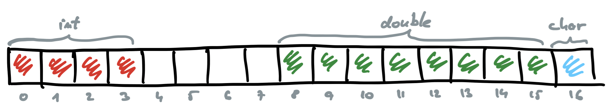
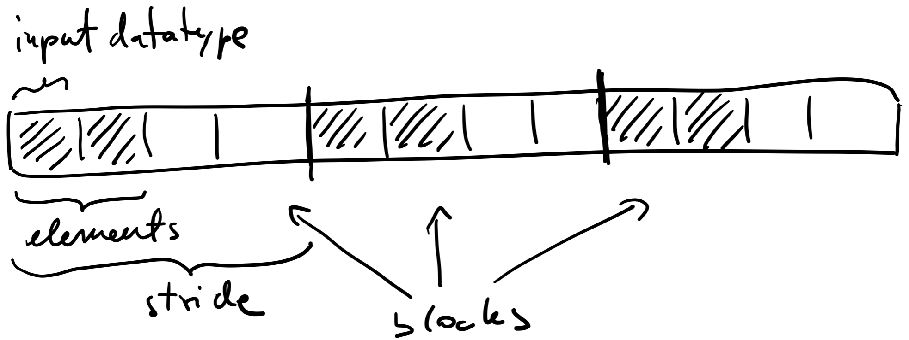
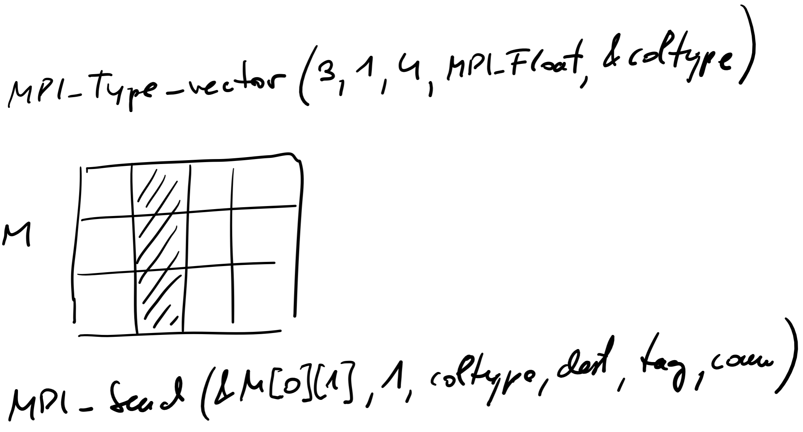
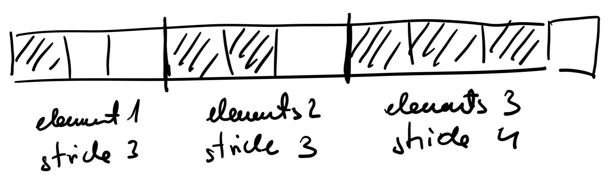
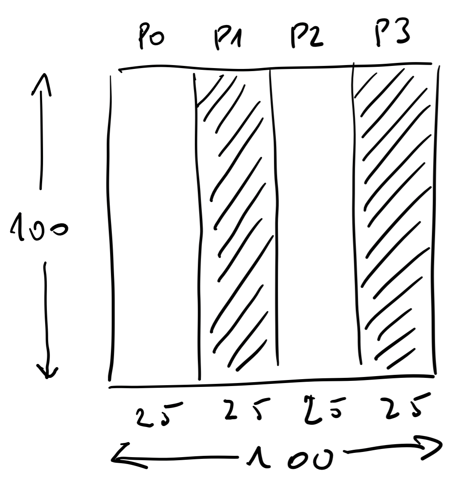
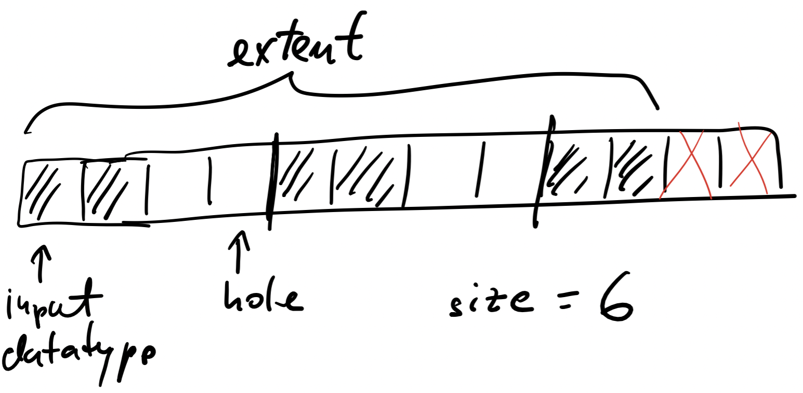

# MPI: Derived Data Types

- any data layout can be described with them
- derived from basic MPI data types
  - for passing data organized as AoS
- allow for efficient transfer of non-contiguous and heterogeneous data
  - example: halo exchange
  - during communication MPI data type tells MPI system where to get the data and where to put it
- both solutions help user to avoid hand-coding
- libraries should have efficient implementations
  - more general data types are slower
  - no need for ```MPI_Pack``` and ```MPI_Unpack```
  - overhead is reduced as only one long message is sent

## Derived Data type

- an object used to describe a data layout in memory by
  - a sequence of basic data types
  - a sequence of displacements
- constructed and destroyed during runtime
- structure
  - ```Typemap```: pairs of basic MPI data types and displacements
    - ```{(type 0, displacement 0), ..., (type N-1, displacement N-1)}```
    - example: ```{(int, 0}, (double, 8), (char, 16)}```

      

- data type routines
  - construction
    - ```MPI_Type_contiguous```: contiguous data type
    - ```MPI_Type_vector```: regularly spaced data type
    - ```MPI_Type_indexed```: variably spaced data type
    - ```MPI_Type_create_subarray```: describes subarray of an array
    - ```MPI_Type_create_struct```: general data type
  - commit
    - ```MPI_Type_commit```: must be called before new data type can be used
  - free
    - ```MPI_Type_free```: marks a data type for deallocation

- example code: [aos.c](files/aos/aos.c)

### ```MPI_Type_contiguous```

- output data type is obtained by concatenating defined number of copies of input data type

  

- constructs a ```typemap``` for output data type consisting of replications of input data type
- example: matrix row as a data type

  

### ```MPI_Type_vector```

- similar to ```MPI_Type_continuous``` but with self-defined stride
- input
  - number of blocks
  - number of elements of input data type in each block
  - stride - number of elements between beginnings of neighbouring blocks

    

- example: matrix column as a data type

    

- example: halo exchange with MPI data types
  - code: [halo.c](files/halo/halo.c)

### ```MPI_Type_indexed```
  
- generalization of MPI_Type_vector
  - number of blocks
  - for each block we specify number of elements and stride

    


### ```MPI_Type_create_subarray```

- creates a data type which is a sub-array of an array
- useful for column-wise distribution of data

    

### ```MPI_Type_create_struct```

- ```Typemap```
  - pairs of basic data types and displacements
- extent
  - span from the lower to the upper bound
  - inner holes are counted, holes at the end are not!
  - important for alignment of data types to data, not for construction and memory allocation
  - query: ```MPI_Type_get_extent```
- size
- number of bytes that has to be transferred
- holes are not counted
- query: ```MPI_Type_size```
- Example
  - to get displacements
  - ```MPI_Type_get_extent```
  - ```MPI_Get_address```

  

### ```MPI_Type_create_resized```

- output data type is identical to the input data type but lower bound and extent are changed
- useful to correct stride for communication
  - example: zip
- when size of MPI data type and system data type are not equal, the MPI data type can be corrected for portability
- example: [zip-unzip.c](files/zip-unzip/zip-unzip.c)
